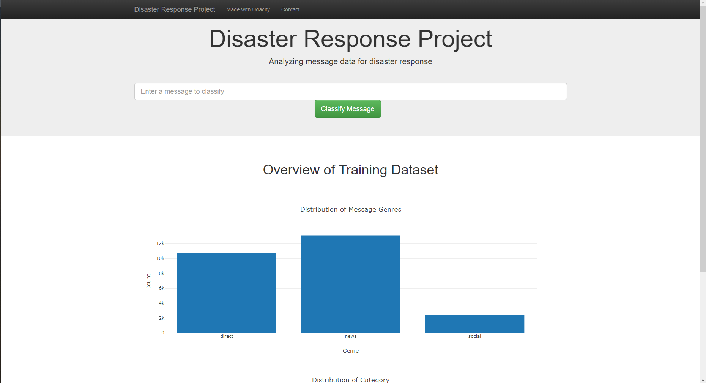

# udacity_data_scientist_disaster_response

## GET_PASSES_THIS_REPO_UDACITY_PLEASE

The project in Udacity Data Scientist Course - Disaster Response Pipeline

The project builds a pipeline to gather dataset, process dataset, create a machine learning model, training, predict and testing the disaster response comment. The results of project include:

- A process data flow
- A pipeline to build, training and testing machine learning model
- A web application for visualize dataset and testing model

### Instructions:

1. Run the following commands in the project's root directory to set up your database and model.

   - To run ETL pipeline that cleans data and stores in database
     `python data/process_data.py data/disaster_messages.csv data/disaster_categories.csv data/DisasterResponse.db`
   - To run ML pipeline that trains classifier and saves
     `python models/train_classifier.py data/DisasterResponse.db models/classifier.pkl`

2. Run the following command in the app's directory to run your web app.
   `python run.py`

3. Go to http://0.0.0.0:3001/

### Library

```bash
flask
joblib
nltk
pandas
plotly
scikit-learn
sqlalchemy
plotly
```

To install, please run the command:

```bash
pip install -r requirements.txt
```

### Dataset

Dataset from Udacity, includes 2 files with CSV format

- `categories.csv`: Include `id` and 36 labeled category of disaster message
- `message.csv`: Include `id`, `message`, `original` and `genre` of disaster message

### Project Motivation

Using Machine Learning model and Natural Language Processing, I predict 36 categories of the disaster by message of disaster. I build a pipeline to ETL dataset, training, testing and inference model. I also build a web app to easyly inference model, and visualize dataset

### Project Descriptions

1. ETL Pipeline

- Loads the `messages` and `categories` datasets
- Merges the two datasets
- Cleans the data
- Stores it in a SQLite database

2. ML Pipeline

- Loads data from the SQLite database
- Splits the dataset into training and test sets
- Builds a text processing and machine learning pipeline
- Trains and tunes a model using GridSearchCV
- Outputs results on the test set
- Exports the final model as a pickle file

3. Flask Web App

- Data visualizations using Plotly in the web app
- Inference model

### Project Structure

- app

  - template
    - master.html # main page of web app
    - go.html # classification result page of web app
  - run.py # Flask file that runs app

- data

  - disaster_categories.csv # data to process
  - disaster_messages.csv # data to process
  - process_data.py
  - DisasterResponse.db # database to save clean data to

- img

  - webapp.png # web app UI

- models

  - train_classifier.py
  - classifier.pkl # saved model

- README.md
- requirements.txt # file to install library


